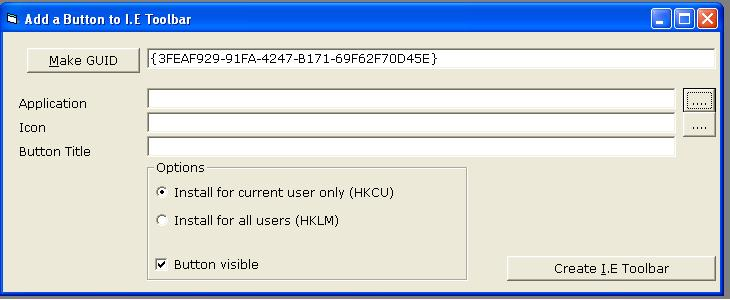



## Add a Button to Internet Explorer

### Description

I found this program on the following http://vbnet.mvps.org/ so I thought I would share it with you guys. I have added a couple of extra features to it. But it basicly adds a button to your internet explorer, with a link to any application you like. All credit goes to Andy Birch (Creator) except for those little bits i added.

You can view the original code at http://vbnet.mvps.org/code/reg/ietoolbarextension.htm

Have fun and please vote
 
### More Info
 

             |
---                |---
**Submitted On**   |2004-05-19 12:18:00
**By**             |[Santa's Little Helper](https://github.com/Planet-Source-Code/PSCIndex/blob/master/ByAuthor/santa-s-little-helper.md)
**Level**          |Intermediate
**User Rating**    |4.6 (23 globes from 5 users)
**Compatibility**  |VB 6\.0
**Category**       |[Internet/ HTML](https://github.com/Planet-Source-Code/PSCIndex/blob/master/ByCategory/internet-html__1-34.md)
**World**          |[Visual Basic](https://github.com/Planet-Source-Code/PSCIndex/blob/master/ByWorld/visual-basic.md)
**Archive File**   |[Add\_a\_Butt1878684202005\.zip](https://github.com/Planet-Source-Code/santa-s-little-helper-add-a-button-to-internet-explorer__1-53883/archive/master.zip)

